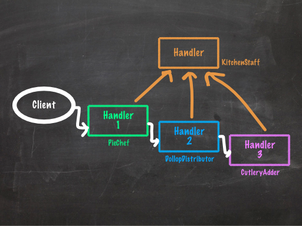
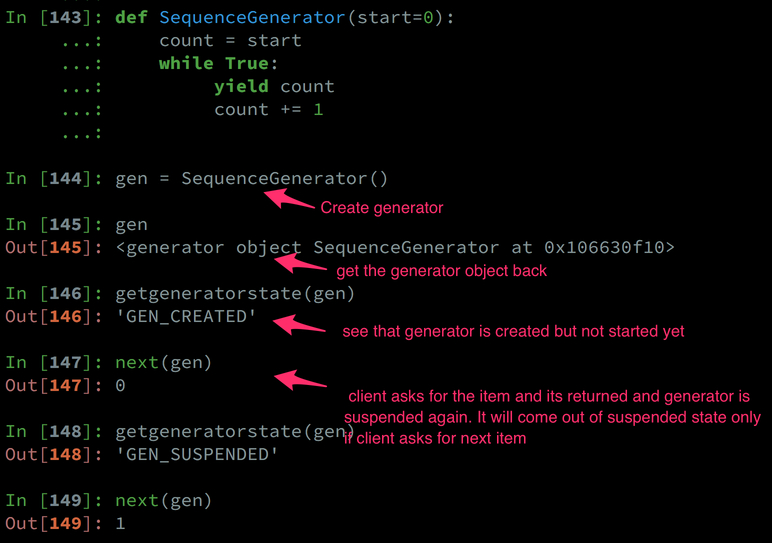
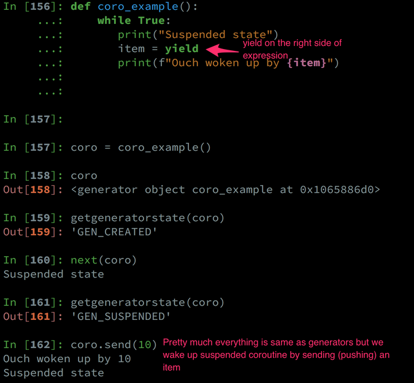

=================================================
Design Pattern : Chain of responsibility [Python]
=================================================

.. author:: Smital Desai
.. categories:: programming
.. tags:: pattern

Hello Pythonistas, Lets dive into chain of responsibility pattern.

Its in fact pretty easy to understand. As shown in diagram above. We have chain of handlers , once the event is generated , its 
passed to the first handler in chain. 

If the handler is able to process the event, the event gets consumed 
but if the handler is unable to process the event, handler then passes this event to the next handler in chain. 

""""""""""""""""""""""""""""""""""""""""""""""""""""""""""""""""""""""""""""""""""""""""""""""""""""""
The bottom line is handlers should pass the event that they cant process, to next handler in chain  
""""""""""""""""""""""""""""""""""""""""""""""""""""""""""""""""""""""""""""""""""""""""""""""""""""""

This can be achieved by traditional way using classes for handlers  and making them implement a common process method 
but in this post we are going to see how coroutines can be used as handlers and how can we form chain of coroutines.

This recipe is present in book `Python in Practice <https://www.amazon.com/Python-Practice-Concurrency-Libraries-Developers/dp/0321905636>`_. I would highly encourage everyone reading this book.

Before we look at the recipe, lets refresh our knowledge of generators and corotuines in Python.

* **Generators:** 
         Any python function with yield keyword is a generator. Generators are actually producer of items. They not only 
         produce the item , but they yield control back to the client so that client can process it. 

         Generators are driven by client : What i mean by that is , unless client asks for the next item , Generators wont produce 
         the next item. This is significatnly important cause it drastically reduces the memory footprint and avoids unnecessary 
         processing of the items at the source just to find out later that client is interested in only of subset of it. 

         **To drive the point home, client pulls the item out of generator cause generator is the producer of item upon clients request.**

         yield item

* **Coroutines:**
         If you look at coroutines , they look pretty similar to generators by the semantics. Yes they have the yield keyword in their 
         function body. But the way it appears is definitely different, its on the right side of an expression.

         item = yield 

         **Fundamental difference when comapred to generators, is that client pushes value into coroutines and it remains suspended till client pushes new value**

         coro.send(10)

Now that we have basics of Generators and Coroutines under the belt lets move on to seeing how we can code chain of responsibility 
using coroutines. 

So to develop an intuition around it, for chain of responsibility we need chain of handlers and we need to be able to **push** event 
to first and subsequent handlers based on the current handler was able to process it or not.

So what if our couroutines knew whom to pass the event if they are not able to handle the pushed event, the current coroutine becomes client(pusher) for the next coroutine.

Also if current coroutine is able to handle the pushed item or not, can be any condition; simple or complex and in our example its as simple as string comparison. 

Now as show below we have three events and three distinct handlers for that 
SongHandler->ImageHandler->SlackHandler to handle these events.

every handler takes its successor as an input and thus we are able to make chain.

.. code-block:: python

   pipeline = SongHandler(ImageHandler(SlackHandler()))

Now go ahead and give below code a good read and i am sure you will be able to appreciate the beauty of the solution. 

.. code-block:: python

    In [107]: events = ["Downloaded Song", "Downloaded PNG image", "Slack notification"]

	In [108]: def SongHandler(successor=None):
	     ...:     while True:
	     ...:         event = yield
	     ...:         if event == "Downloaded Song":
	     ...:             print("I am handling this song")
	     ...:         else:
	     ...:            print(f"I cant handle {event}")
	     ...:            if successor is not None:
	     ...:                successor.send(event)
	     ...:            else:
	     ...:                print(f"Cant handle the {event}")
	     ...:
	
	In [109]: d = SongHandler()
	
	In [110]: d
	Out[110]: <generator object SongHandler at 0x105e29830>
	
	In [111]: from inspect import getgeneratorstate
	
	In [112]: getgeneratorstate(d)
	Out[112]: 'GEN_CREATED'
	
	In [113]: next(d)
	
	In [114]: getgeneratorstate(d)
	Out[114]: 'GEN_SUSPENDED'
	
	In [115]: d.send("Downloaded PNG image")
	I cant handle Downloaded PNG image
	Cant handle the Downloaded PNG image

	In [116]: def ImageHandler(successor=None):
         ...:     while True:
         ...:        event = yield
         ...:        if event == "Downloaded PNG image":
         ...:           print("I am handling this PNG image")
         ...:        else:
         ...:           print(f"I cant handle event : {event}")
         ...:           if successor is not None:
         ...:              successor.send(event)
         ...:           else:
         ...:              print(f"Cant handle the event : {event}")
         ...:

	In [117]:
	
	In [117]: pipeline = SongHandler(ImageHandler())
	
	In [118]: pipeline
	Out[118]: <generator object SongHandler at 0x1065cef68>
	
	In [119]: next(pipeline)
	
	In [120]: pipeline.send("Downloaded PNG image")
	I cant handle Downloaded PNG image

	---------------------------------------------------------------------------
	TypeError                                 Traceback (most recent call last)
	<ipython-input-120-beb994dea500> in <module>()
	----> 1 pipeline.send("Downloaded PNG image")
	
	<ipython-input-108-48988309dc83> in SongHandler(successor)
	      7            print(f"I cant handle {event}")
	      8            if successor is not None:
	----> 9                successor.send(event)
	     10            else:
	     11                print(f"Cant handle the {event}")
	
	TypeError: can't send non-None value to a just-started generator
	
	In [121]: # This is where its important to understand the priming of the generator. Now we did prime the SongHandl
	      ...: er by doing next(pipeline) but SongHandler has Imagehandler as prameter SongHandler(ImageHandler()) whic
	      ...: h is not primed.
	
	In [122]: # Thats the reason why we see this TypeError : can't send non-None value to a just-started generator

	In [123]: from functools import wraps

	In [124]: def coroutine(func):
     	  ...:     @wraps(func)
     	  ...:     def wrapper(*args, **kwargs):
     	  ...:         gen = func(*args, **kwargs)
     	  ...:         next(gen)         # The only thing that it does is moves generator to suspended state from created state to 
     	                                 # avoid above error 
     	  ...:         return gen
     	  ...:     return wrapper
     	  ...:
     	  ...:

   	  	  @coroutine
   	  ...: def SongHandler(successor=None):
   	  ...:       while True:
   	  ...:           event = yield
   	  ...:           if event == "Downloaded Song":
   	  ...:               print("[SongHandler] : handling this song")
   	  ...:           else:
   	  ...:              print(f"[SongHandler] : cant handle {event}")
   	  ...:              if successor is not None:
   	  ...:                  successor.send(event)
   	  ...:              else  :
   	  ...:                  print(f"Cant handle the {event}")
   	  ...:
   	  ...:
   	  ...: @coroutine
   	  ...: def ImageHandler(successor=None):
   	  ...:       while True:
   	  ...:          event = yield
   	  ...:          if event == "Downloaded PNG image":
   	  ...:             print("[ImageHandler] : handling this PNG image")
   	  ...:          else:
   	  ...:             print(f"[ImageHandler] : cant handle event : {event}")
   	  ...:             if successor is not None:
   	  ...:                successor.send(event)
   	  ...:             else:
   	  ...:                print(f"[ImageHandler] : No more takers for this event. Getting dropped :-(")

   		      @coroutine
    	  ...: def SlackHandler(successor=None):
    	  ...:       while True:
    	  ...:          event = yield
    	  ...:          if event == "Slack notification":
    	  ...:             print("[ SlackHandler ] : handling this slack notification")
    	  ...:          else:
    	  ...:             print(f"[ SlackHandler ] : cant handle event : {event}")
    	  ...:             if successor is not None:
    	  ...:                successor.send(event)
    	  ...:             else:
    	  ...:                print(f"[ SlackHandler ] No more handlers for this event : {event}. Getting dropped :-(")
    	  ...:

	pipeline = SongHandler(ImageHandler(SlackHandler()))
	
	In [139]: pipeline.send("Slack notification")
	[SongHandler] : cant handle Slack notification
	[ImageHandler] : cant handle event : Slack notification
	[ SlackHandler ] : handling this slack notification
	
	In [140]: pipeline.send("Downloaded PNG image")
	[SongHandler] : cant handle Downloaded PNG image
	[ImageHandler] : handling this PNG image
	
	In [141]: pipeline.send("Downloaded Song")
	[SongHandler] : handling this song                             
       	
    
