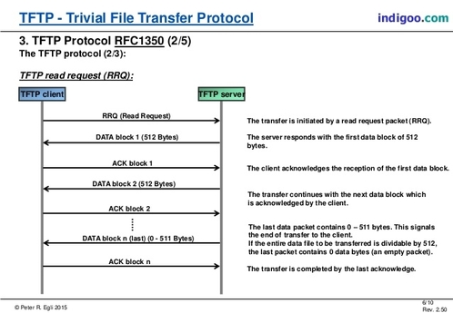
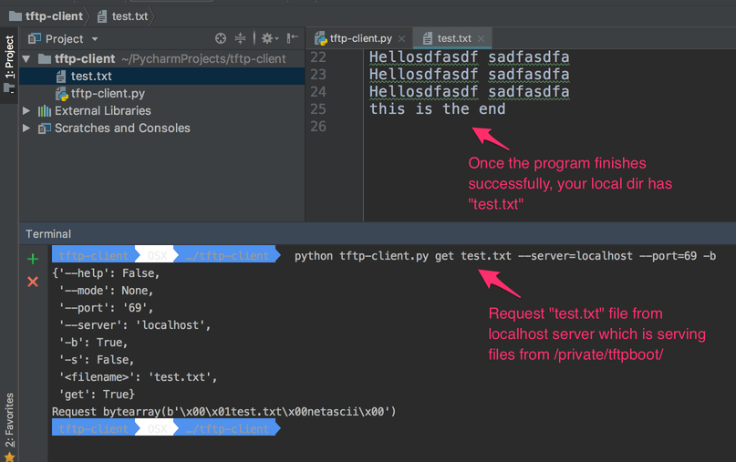

========================================================
Understanding TFTP proto and write TFTP client in Python
========================================================

.. author:: Smital Desai
.. categories:: programming
.. tags:: network-programming

Hello Pythonistas, TFTP [ Trivial File Transfer Protocol ] is a light weight file transfer protocol, 
there is really not much to it as seen in the above picture. Its a UDP [ User datagram protocol ] protocol.
There are connection oriented and connectionless protocols and TFTP falls under the later category.

Without getting into too much of technical details , lets see how the protocol plays in action.
On my mac i have set up TFTP server and there is builtin tftp client

.. code-block:: bash

	env  OSX  …/CLIENT  tftp 
	tftp> ?
	Commands may be abbreviated.  Commands are:
	
	connect 	connect to remote tftp
	mode    	set file transfer mode
	put     	send file
	get     	receive file
	quit    	exit tftp
	verbose 	toggle verbose mode
	blksize 	set an alternative blocksize (def. 512)
	tsize   	toggle extended tsize option
	trace   	toggle packet tracing
	status  	show current status
	binary  	set mode to octet
	ascii   	set mode to netascii
	rexmt   	set per-packet retransmission timeout
	timeout 	set total retransmission timeout
	tout    	toggle extended timeout option
	?       	print help information
	tftp> connect localhost
	tftp> trace
	Packet tracing on.
	tftp> status
	Connected to localhost.
	Mode: netascii Verbose: off Tracing: on
	Rexmt-interval: 5 seconds, Max-timeout: 25 seconds

	tftp> get test.txt test.txt
	sent RRQ <file=test.txt, mode=netascii>
	received DATA <block=1, 512 bytes>
	sent ACK <block=1>
	received DATA <block=2, 64 bytes>
	Received 576 bytes in 0.0 seconds 

===========================
Protocol in action summary:
===========================

As shown above the protocol can be seen in action on the last 6 lines or so.

1. Client sends a Read Request specifying a file and mode. [ We can see opcodes for that in RFC ]
2. Server responds with block of data along with block number.
3. Client sends an ACK for the received block
4. Server sends next data with incremented block number and ...... 

**Normal Termination** - This excerpt is taken directly from `RFC 1350 <https://tools.ietf.org/html/rfc1350/>`_
  The end of a transfer is marked by a DATA packet that contains
  between 0 and 511 bytes of data (i.e., Datagram length < 516).  This
  packet is acknowledged by an ACK packet like all other DATA packets.
  The host acknowledging the final DATA packet may terminate its side
  of the connection on sending the final ACK.

		=======  =========
		Opcode   Operation 
		=======  ========= 
		 1       Read request (RRQ)
		 2       Write request (WRQ)
		 3       Data (DATA)
		 4       Acknowledgment (ACK)
		 5       Error (ERROR)
		=======  ========= 

===================================
How to start TFTP server on Mac ? 
===================================
.. code-block:: bash

        sudo launchctl load -F /System/Library/LaunchDaemons/tftp.plist
        sudo launchctl start com.apple.tftpd	

**The directory that serves files is /private/tftpboot.**

To stop the TFTP server, either reboot or use this command:

.. code-block:: bash

        sudo launchctl unload -F /System/Library/LaunchDaemons/tftp.plist        	

Now lets look at the command line interface of the application that we wish to create        

.. code-block:: bash
    
           tftp-client  OSX  …/tftp-client   python tftp-client.py -h
           tftp-client.
           Usage:
             tftp-client.py get <filename> [[-s | -b ] --mode=<mode>]
             tftp-client.py (-h | --help)
           
           Options:
             -h --help     Show this screen.
             -s            Use python struct to build request.
             -b            Use python bytearray to build request.
             --mode=<mode> TFTP transfer mode : "netascii", "octet", or "mail"

Once we know the interface, lets see how we can code it. 

==========
Algorithm: 
==========
1. Get the server and port information 
2. Get the mode information [ Set default to netascii ] 
3. Send the Read Request 
4. Go in a while loop and read the data that server sends
5. If server sends error -> Quit 
6. If server sends proper data packet , send ack for each packet.
7. If the length of the received data is less than 516 -> This is the last packet; so Quit.

.. code-block:: python

        """tftp-client.
        Usage:
          tftp-client.py get <filename> [[-s | -b ] --mode=<mode>]
          tftp-client.py (-h | --help)
        
        Options:
          -h --help     Show this screen.
          -s            Use python struct to build request.
          -b            Use python bytearray to build request.
          --mode=<mode> TFTP transfer mode : "netascii", "octet", or "mail"
        """
        
        from docopt import docopt
        import socket
        from struct import pack
        
        """
            opcode  operation
             1     Read request (RRQ)
             2     Write request (WRQ)
             3     Data (DATA)
             4     Acknowledgment (ACK)
             5     Error (ERROR)
             
        >>>>>>>>>>>>>>>>>>>>>>>>>>>>>>>>>>>>>>>>>>>>>>>>>>>>>>>>>>>>>>     
           
              2 bytes     string    1 byte     string   1 byte
             ------------------------------------------------
            | Opcode |  Filename  |   0  |    Mode    |   0  |
             ------------------------------------------------
             
            Figure 5-1: RRQ/WRQ packet
        
           The [[ Mode ]] field contains the
           
           string "netascii", "octet", or "mail" (or any combination of upper
           and lower case, such as "NETASCII", NetAscii", etc.)
        
        
        >>>>>>>>>>>>>>>>>>>>>>>>>>>>>>>>>>>>>>>>>>>>>>>>>>>>>>>>>>>>>>>
        
              2 bytes     2 bytes
             ---------------------
            | Opcode |   Block #  |
             ---------------------
        
             Figure 5-3: ACK packet     
                        
        >>>>>>>>>>>>>>>>>>>>>>>>>>>>>>>>>>>>>>>>>>>>>>>>>>>>>>>>>>>>>>>               
                        
              2 bytes     2 bytes      n bytes
             ----------------------------------
            | Opcode |   Block #  |   Data     |
             ----------------------------------
         
             Figure 5-2: DATA packet  
        >>>>>>>>>>>>>>>>>>>>>>>>>>>>>>>>>>>>>>>>>>>>>>>>>>>>>>>>>>>>>>>>
        
        TFTP Formats
        
           Type   Op #     Format without header
        
                  2 bytes    string   1 byte     string   1 byte
                  -----------------------------------------------
           RRQ/  | 01/02 |  Filename  |   0  |    Mode    |   0  |
           WRQ    -----------------------------------------------
           
           
                  2 bytes    2 bytes       n bytes
                  ---------------------------------
           DATA  | 03    |   Block #  |    Data    |
                  ---------------------------------
                  
                  
                  2 bytes    2 bytes
                  -------------------
           ACK   | 04    |   Block #  |
                  --------------------
                  
                  
                  2 bytes  2 bytes        string    1 byte
                  ----------------------------------------
           ERROR | 05    |  ErrorCode |   ErrMsg   |   0  |
                  ----------------------------------------     
                  
        Error Codes
        
           Value     Meaning
        
           0         Not defined, see error message (if any).
           1         File not found.
           2         Access violation.
           3         Disk full or allocation exceeded.
           4         Illegal TFTP operation.
           5         Unknown transfer ID.
           6         File already exists.
           7         No such user.          
                     
        ====================
        Protocol in action
        ====================
        
        As shown above the protocol can be seen in action on the last 6 lines or so.
        
        1. Client sends a Read Request specifying a file and mode. [ We can see opcodes for that in RFC ]
        2. Server responds with block of data along with block number.
        3. Client sends an ACK for the received block
        4. Server sends next data with incremented block number and ...... 
        
        ** Normal Termination ** - This excerpt is taken directly from `RFC 1350 <https://tools.ietf.org/html/rfc1350/>`_
          The end of a transfer is marked by a DATA packet that contains
          between 0 and 511 bytes of data (i.e., Datagram length < 516).  This
          packet is acknowledged by an ACK packet like all other DATA packets.
          The host acknowledging the final DATA packet may terminate its side
          of the connection on sending the final ACK.
            
        """
        TERMINATING_DATA_LENGTH = 516
        TFTP_TRANSFER_MODE = b'netascii'
        
        TFTP_OPCODES = {
            'unknown': 0,
            'read': 1,  # RRQ
            'write': 2,  # WRQ
            'data': 3,  # DATA
            'ack': 4,  # ACKNOWLEDGMENT
            'error': 5}  # ERROR
        
        TFTP_MODES = {
            'unknown': 0,
            'netascii': 1,
            'octet': 2,
            'mail': 3}
        
        # Create a UDP socket
        sock = socket.socket(socket.AF_INET, socket.SOCK_DGRAM)
        server_address = ('localhost', 69)
        
        
        def send_rq(filename, mode):
            """
            This function constructs the request packet in the format below.
            Demonstrates how we can construct a packet using bytearray.
        
                Type   Op #     Format without header
        
                       2 bytes    string   1 byte     string   1 byte
                       -----------------------------------------------
                RRQ/  | 01/02 |  Filename  |   0  |    Mode    |   0  |
                WRQ    -----------------------------------------------
        
        
            :param filename:
            :return:
            """
            request = bytearray()
            # First two bytes opcode - for read request
            request.append(0)
            request.append(1)
            # append the filename you are interested in
            filename = bytearray(filename.encode('utf-8'))
            request += filename
            # append the null terminator
            request.append(0)
            # append the mode of transfer
            form = bytearray(bytes(mode, 'utf-8'))
            request += form
            # append the last byte
            request.append(0)
        
            print(f"Request {request}")
            sent = sock.sendto(request, server_address)
        
        
        def send_rq_struct(filename, mode):
            """
            This function constructs the request packet in the format below
            Demonstrates how we can construct a packet using struct.
        
                Type   Op #     Format without header
                       2 bytes    string   1 byte     string   1 byte
                       -----------------------------------------------
                RRQ/  | 01/02 |  Filename  |   0  |    Mode    |   0  |
                WRQ    -----------------------------------------------
        
                :param filename:
                :return:
            """
            formatter = '>h{}sB{}sB'  # { > - Big Endian, h - short , s - char, B - 1 byte }
            formatter = formatter.format(len(filename), len('netascii'))
            print(formatter)  # final format '>h8sB8sB'
            request = pack(formatter, TFTP_OPCODES['read'], bytes(filename, 'utf-8'), 0, bytes(mode, 'utf-8'), 0)
        
            print(f"Request {request}")
            sent = sock.sendto(request, server_address)
        
        
        def send_ack(ack_data, server):
            """
            This function constructs the ack using the bytearray.
            We dont change the block number cause when server sends data it already has
            block number in it.
        
                      2 bytes    2 bytes
                     -------------------
              ACK   | 04    |   Block #  |
                     --------------------
            :param ack_data:
            :param server:
            :return:
            """
            ack = bytearray(ack_data)
            ack[0] = 0
            ack[1] = TFTP_OPCODES['ack']
            print(ack)
            sock.sendto(ack, server)
        
        
        def server_error(data):
            """
            We are checking if the server is reporting an error
                        2 bytes  2 bytes        string    1 byte
                      ----------------------------------------
               ERROR | 05    |  ErrorCode |   ErrMsg   |   0  |
                      ----------------------------------------
            :param data:
            :return:
            """
            opcode = data[:2]
            return int.from_bytes(opcode, byteorder='big') == TFTP_OPCODES['error']
        
        
        # Map server error codes to messages [ Taken from RFC-1350 ]
        server_error_msg = {
            0: "Not defined, see error message (if any).",
            1: "File not found.",
            2: "Access violation.",
            3: "Disk full or allocation exceeded.",
            4: "Illegal TFTP operation.",
            5: "Unknown transfer ID.",
            6: "File already exists.",
            7: "No such user."
        }
        
        
        def main():
            arguments = docopt(__doc__)
            filename = arguments['<filename>']
            print(arguments)
            if arguments['--mode'] is not None:
                mode = arguments['--mode']
                if mode.lower() not in TFTP_MODES.keys():
                    print("Unknown mode - defaulting to [ netascii ]")
                    mode = "netascii"
            else:
                mode = "netascii"
        
            # Send request
            if arguments['-s']:
                send_rq_struct(filename, mode)
            elif arguments['-b']:
                send_rq(filename, mode)
            else:
                send_rq_struct(filename)
        
            # Open file locally with the same name as that of the requested file from server
            file = open(filename, "wb")
            while True:
                # Wait for the data from the server
                data, server = sock.recvfrom(600)
        
                if server_error(data):
                    error_code = int.from_bytes(data[2:4], byteorder='big')
                    print(server_error_msg[error_code])
                    break
                send_ack(data[0:4], server)
                content = data[4:]
                # print(f"Content : {content}")
                file.write(content)
                # print(f"## Data ##: {data[0:4]} : {len(data)}")
                if len(data) < TERMINATING_DATA_LENGTH:
                    break
        
        
        if __name__ == '__main__':
            main()

Lets look at how the sample run of the program looks like. 

