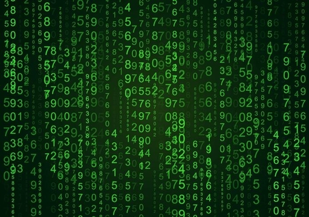
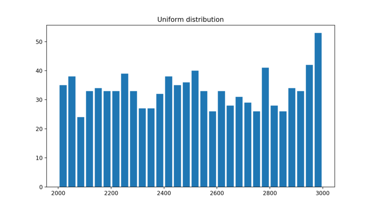
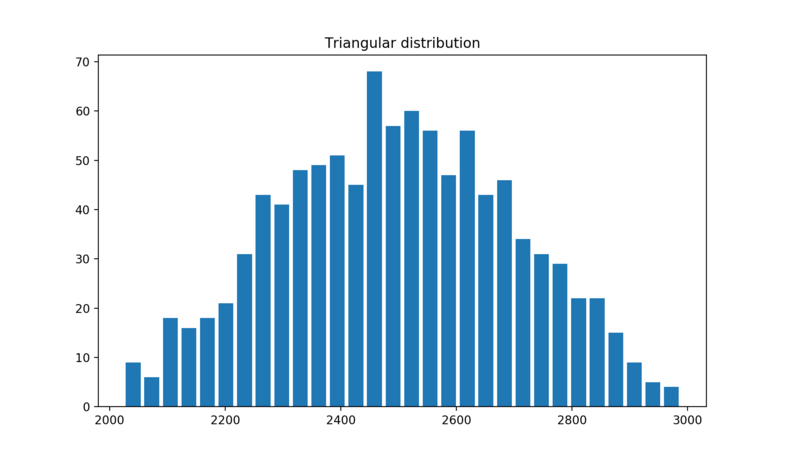
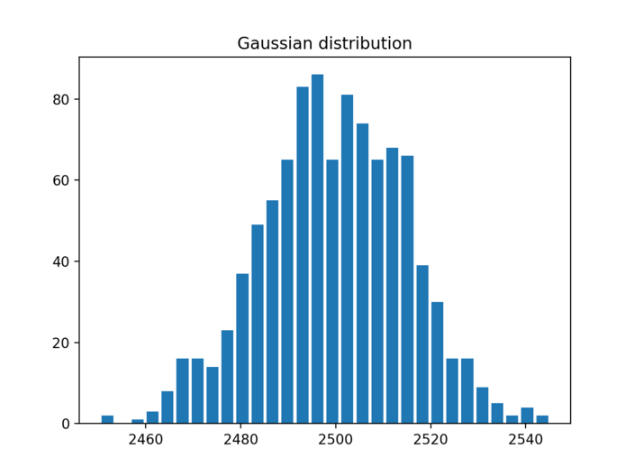
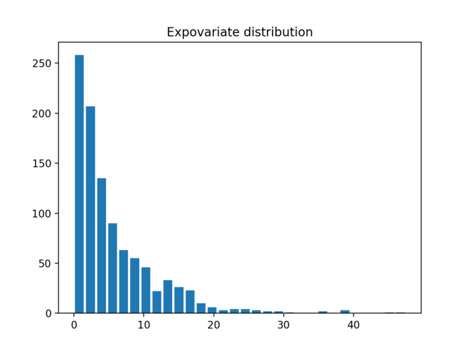

============================================================
Python's random module :  Real-valued distributions
============================================================

.. author:: Smital Desai
.. categories:: programming
.. tags:: statistics

Hello Pythonistas , In my opinion the better to understand distributions is to visualize them.

--------------------
Uniform Distrubution
--------------------
Lets say , you would like to create random numbers between **2000 and 3000** such that the generated 
values are uniformly distributed over the range. Here we are creating 1000 values over the range.
Histogram is really useful tool to bucketize a given set of values into given buckets. 

.. code:: python

   import matplotlib.pyplot as plt
   from random import *

   population_data = [uniform(2000, 3000) for i in range(1000)]

   plt.hist(population_data, bins=30, histtype="bar", rwidth=0.8)
   plt.title("Uniform distribution")
   plt.show()

-----------------------
Triangular Distribution
-----------------------
Lets say , you would like to create random numbers between **2000 and 3000** such that the generated 
values are triangularly distributed over the range. What i mean by Triangulary distributed is; 
mid point between 2000 and 3000 is 2500. so more values will generated around this midpoint rather than
towards both the ends of range like less values towards 2000 and less values towards 3000. 

.. code:: python

   import matplotlib.pyplot as plt
   from random import *
   
   population_data = [triangular(2000, 3000) for i in range(1000)]
   
   plt.hist(population_data, bins=30, histtype="bar", rwidth=0.8)
   plt.title("Triangular distribution")
   plt.show()

---------------------
Gaussian Distribution
---------------------
Sometimes when you wish to tightly control the values generated around midpoint.
In gaussian distribution you specify the mean and the max variation thats allowed from mean. [ Standard Deviation ]

In this example we generate values such that the mean is 2500 and allowed variation from mean is 15.
If you carefully look at the output and compare it to Triangular distribution , you will see that density of values around 
mean is way higher than its seen with Triangular distribution.

In fact all the values are between 2460 to 2540

.. code:: python

    import matplotlib.pyplot as plt
    from random import *
    
    population_data = [gauss(2500, 15) for i in range(1000)]
    
    plt.hist(population_data, bins=30, histtype="bar", rwidth=0.8)
    plt.title("Gaussian distribution")
    plt.show()

------------------------
Expovariate Distribution
------------------------

This is also another useful distribution where you would like to simulate 

1. arrival times of customer 
2. arrival of network packets 

for example when you go to bank , you can see that customers arrive randomly. 
sometimes they come in a bunch, but every once a in while there is no one.

Same thing hanppens with network packets , they come in a bunch and sometimes there is 
no network traffic.

average_arrival_interval = 5.6

.. code:: python

    import matplotlib.pyplot as plt
    from random import *
    
    population_data = [expovariate(1/5.6) for i in range(1000)]
    
    plt.hist(population_data, bins=30, histtype="bar", rwidth=0.8)
    plt.title("Expovariate distribution")
    plt.show()    

Now if you are thinking where you would use these distributions, Random module has a great section on example and Recipe's 
`Example <https://docs.python.org/3/library/random.html#examples-and-recipes>`_

----------------------------------------------------------------------------
Simulation of arrival times and service deliveries in a single server queue:
----------------------------------------------------------------------------

.. code:: python

    from random import expovariate, gauss
    from statistics import mean, median, stdev
    
    average_arrival_interval = 5.6
    average_service_time = 5.0
    stdev_service_time = 0.5
    
    num_waiting = 0
    arrivals = []
    starts = []
    arrival = service_end = 0.0
    for i in range(20000):
        if arrival <= service_end:
            num_waiting += 1
            # see how expovariate is used to simulate arrival times 
            arrival += expovariate(1.0 / average_arrival_interval)
            arrivals.append(arrival)
        else:
            num_waiting -= 1
            service_start = service_end if num_waiting else arrival
            # see how gaussian is used to get the average service time by allowing margin 
            # for variability in servicing requests. 
            service_time = gauss(average_service_time, stdev_service_time)
            service_end = service_start + service_time
            starts.append(service_start)
    
    waits = [start - arrival for arrival, start in zip(arrivals, starts)]
    print(f'Mean wait: {mean(waits):.1f}.  Stdev wait: {stdev(waits):.1f}.')
    print(f'Median wait: {median(waits):.1f}.  Max wait: {max(waits):.1f}.')

--------------------------------------
Bonus - Dont miss the See Also section
--------------------------------------
See also `Statistics for Hackers <https://www.youtube.com/watch?v=Iq9DzN6mvYA>`_ a video tutorial by `Jake Vanderplas <https://us.pycon.org/2016/speaker/profile/295/>`_ on statistical analysis using just a few fundamental concepts including simulation, sampling, shuffling, and cross-validation.

`Economics Simulation <http://nbviewer.jupyter.org/url/norvig.com/ipython/Economics.ipynb>`_ a simulation of a marketplace by `Peter Norvig <http://norvig.com/bio.html>`_ that shows effective use of many of the tools and distributions provided by this module (gauss, uniform, sample, betavariate, choice, triangular, and randrange).

`A Concrete Introduction to Probability <http://nbviewer.jupyter.org/url/norvig.com/ipython/Probability.ipynb>`_ (using Python) a tutorial by `Peter Norvig <http://norvig.com/bio.html>`_ covering the basics of probability theory, how to write simulations, and how to perform data analysis using Python.