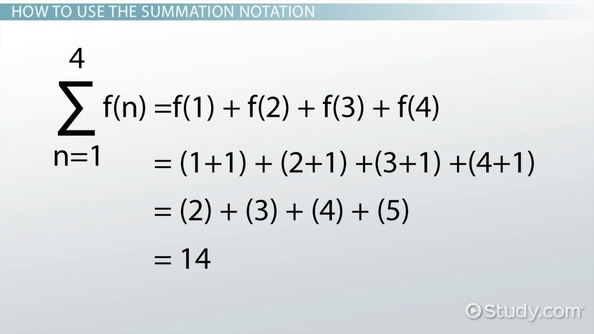
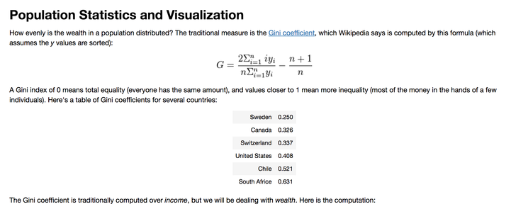
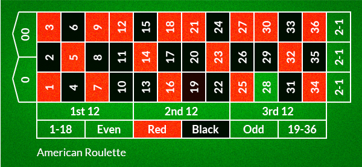

============================================================
Represent Mathematical formulae programmatically
============================================================

.. author:: Smital Desai
.. categories:: programming
.. tags:: math

Hello Pythonistas , In this blog post we are trying to see how can we represent the mathematical 
formula that uses summation notation in Python. I am not really a math lover so whenever i see 
something represented in this kind of formula , i get nervous about whether i will be able to handle it 
or not.

--------------------
Gini Coefficient
--------------------

This excerpt has been taken from `Economics simulation <http://nbviewer.jupyter.org/url/norvig.com/ipython/Economics.ipynb>`_.

As seen in the formula , i goes from 1 to n which can be done using for loop  ** for i in range(n) ** 
for numerator , we can see that for each i we are performing ** ( i * y[i] )
and finally there is sum() function which is replacing the sigma.

for the denominator we are not doing any alteration on each iteration we can simply invoke sum() on y 

.. code:: python

    def gini(y):
       "Compute the Gini coefficient (a measure of equality/inequality) in a population, y."
       y = sorted(y)
       n = len(y)
       numer = 2 * sum((i) * y[i] for i in range(1, n))
       denom = n * sum(y)
       return (numer / denom) - (n + 1) / n

--------------------
Chained comparisons
--------------------

.. code:: python

      In [2]: x = 10
     
      In [3]: y = 20
      
      In [4]: 15 > x and 15 < y
      Out[4]: True
      
      In [5]: x < 15 < y
      Out[5]: True

------------------------
Simulating Roulle spins
------------------------

How to perform Six roulette wheel spins (weighted sampling with replacement)
There are 18 Red slots , 18 black slots and 6 green slots.
.. code:: python

   >>> from random import *
   >>> choices(['red', 'black', 'green'], [18, 18, 2], k=6)
   ['red', 'green', 'black', 'black', 'red', 'black']            

-------------
Biased Coins
-------------

.. code:: python

   >>> # Estimate the probability of getting 5 or more heads from 7 spins
   >>> # of a biased coin that settles on heads 60% of the time.
   >>> trial = lambda: choices('HT', cum_weights=(0.60, 1.00), k=7).count('H') >= 5
  >>> sum(trial() for i in range(10000)) / 10000
      0.4169  